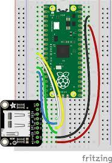

# Precentacion de la tarjeta MicroSD Card
En este estsremos precentando una breve explicacion sobre el funcionamiento y como se debe colocar las conexiones en la rasberry pico w

## La Interfaz de MicroSD a Pico con el modulo

## La Interfaz de MicroSD a Pico sin el modulo

